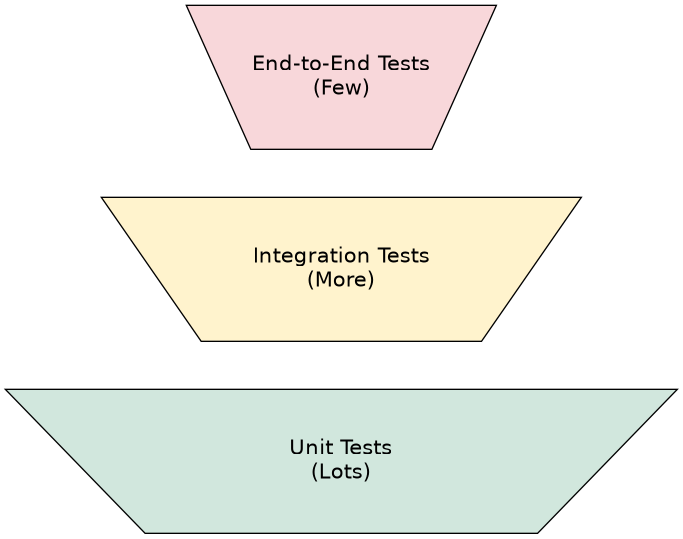

# Comprehensive Microservice Testing Plan

## 1. Introduction: The Imperative of a Test-First Approach

Before embarking on significant architectural changes, such as the integration of third-party services like SendGrid for notifications and various payment gateways (Stripe, PayPal, etc.), it is not just recommended but **essential** to establish a robust, automated testing suite for the existing application. Attempting to build new functionality on an untested foundation is a recipe for instability, cascading failures, and intractable debugging sessions.

This document outlines a detailed, service-by-service testing plan designed to create a comprehensive safety net for the Real-Time Payment System.

### Why Testing First is Non-Negotiable

1.  **To Create a Known-Good Baseline**: The current codebase represents the functioning business logic of the system. An automated test suite acts as an executable specification—a guarantee of this behavior. When new dependencies like the Stripe SDK are introduced, any breakage will be immediately pinpointed by the failing tests. This allows developers to know with certainty whether a bug exists in the new integration code or if the existing logic was inadvertently broken. Without this baseline, debugging becomes a process of guesswork.

2.  **To De-risk Refactoring**: The proposed integration plans inherently require refactoring. For instance, the existing `EmailNotificationService` will be replaced with a SendGrid-specific implementation, and a new `PaymentExecutionService` will be introduced to handle gateway logic. Making such structural changes without a test suite is profoundly risky. Tests provide immediate feedback, confirming that the refactored components still adhere to their expected contracts and have not introduced unintended side effects.

3.  **To Isolate Failures in a Distributed System**: The system's event-driven, asynchronous nature means failures can be subtle and can cascade across service boundaries. If a payment fails, how can we be sure of the cause? Was it a legitimate failure from the payment gateway, or did the `TransactionCommandService` fail to publish the `PaymentProcessingStartedEvent`? Did the `FraudCheckEventListener` fail to consume its trigger event? By thoroughly testing the internal mechanics—event publishing, consumption, and command handling—we can confidently isolate failures to the new integration points, drastically reducing debugging time.

4.  **To Enforce and Formalize System Contracts**: Tests are the ultimate documentation for a component's contract. A well-written test for the `TransactionAggregate` guarantees that when it handles a `ProcessFraudCheckCommand` with a passing result, it *will always* generate a `PaymentProcessingStartedEvent`. The entire payment gateway integration hinges on the reliability of this contract. Solidifying these implicit contracts into explicit, automated tests is a prerequisite for building stable new features.

## 2. Foundational Concepts and Tooling

### The Testing Pyramid

Our strategy is guided by the Testing Pyramid, which advocates for a healthy balance of different types of tests:

-   **Unit Tests (Base of the Pyramid)**: These form the largest part of our test suite. They are fast, isolated, and verify a single "unit" of code (e.g., a class or method) without external dependencies like databases, message brokers, or network calls.
-   **Integration Tests (Middle of the Pyramid)**: Fewer in number, these tests verify the collaboration of several components within a *single service*. For example, they test the flow from a controller to a service, to a repository, and its interaction with real infrastructure like a database or Kafka, often managed by Testcontainers.
-   **End-to-End (E2E) Tests (Top of the Pyramid)**: The fewest tests, they simulate a full user journey across multiple services to verify the entire system works as expected. This plan focuses on building the critical Unit and Integration test layers.

### Recommended Tooling Stack

-   **JUnit 5**: The primary framework for writing tests in the Java ecosystem.
-   **Mockito**: The standard for creating "mocks" and "stubs" of dependencies, allowing for true unit testing in isolation.
-   **AssertJ**: Provides a fluent, readable API for writing assertions (e.g., `assertThat(result).isEqualTo(expected)`).
-   **Spring Boot Test**: Offers essential annotations and utilities (`@SpringBootTest`, `MockMvc`) for testing Spring applications.
-   **Testcontainers**: A critical library for integration testing. It manages the lifecycle of Docker containers for dependencies like PostgreSQL and Kafka, ensuring tests run against a clean, real, and consistent environment every time.

## 3. Service-by-Service Testing Plan

### 3.1. `transaction-service`: The System's Front Door

This service acts as the API Gateway, responsible for accepting client requests and initiating the payment saga. If it fails, no payments can be processed.

#### `TransactionController` (Integration Test)

-   **Goal**: To perform an end-to-end validation of the service's entire responsibility: receiving an HTTP request, validating it, and successfully publishing a command to Kafka. This is the most valuable test for this service.
-   **How**: This test will use `@SpringBootTest(webEnvironment = SpringBootTest.WebEnvironment.RANDOM_PORT)` to launch the service with a real web server. It will use **Testcontainers** to spin up an ephemeral Kafka broker for the duration of the test. `@DynamicPropertySource` will be used to configure the application at runtime to connect to this test-specific Kafka instance.
-   **Test Cases**:
    -   **Happy Path: Successful Transaction Initiation**
        -   **Arrange**: Create a valid `CreateTransactionRequest` DTO.
        -   **Act**: Use `TestRestTemplate` to make a `POST` request to the `/transactions` endpoint.
        -   **Assert**:
            1.  **HTTP Response**: Assert the status is `202 Accepted`, the correct code for acknowledging an asynchronous operation.
            2.  **Response Body**: Assert the JSON response contains a non-null, properly formatted `transactionId`.
            3.  **Kafka Message**: Use a test-specific `@KafkaListener` to consume from the output topic. Assert that a message is received within a reasonable timeout (e.g., 5 seconds).
            4.  **Message Content**: Assert the deserialized Kafka message (`CreateTransactionCommand`) contains the exact data sent in the initial HTTP request.
    -   **Validation Failure: Invalid Request Data**
        -   **Arrange**: Create a `CreateTransactionRequest` with invalid data (e.g., a negative amount, null currency).
        -   **Act**: Make a `POST` request.
        -   **Assert**:
            1.  **HTTP Response**: Assert the status is `400 Bad Request`.
            2.  **Kafka Message**: Critically, assert that **no message** was published to the Kafka topic, preventing invalid data from poisoning the saga.

#### `TransactionService` (Unit Test)

-   **Goal**: To test the service layer's logic in isolation, specifically its interaction with the Kafka producer.
-   **How**: A standard unit test using `@ExtendWith(MockitoExtension.class)`. The `KafkaTemplate` dependency will be mocked using `@Mock`.
-   **Test Case**:
    -   **`initiateTransaction` calls Kafka producer**:
        -   **Arrange**: Create a valid `CreateTransactionRequest`.
        -   **Act**: Call `transactionService.initiateTransaction()`.
        -   **Assert**: Use `Mockito.verify()` to confirm that `kafkaTemplate.send()` was called exactly once, on the correct topic, and with a payload matching the input.

### 3.2. `fraud-detection-service`: The First Step in the Saga

This service's reliability is paramount for the payment flow to continue.

#### `FraudCheckEventListener` (Integration Test)

-   **Goal**: To confirm the service correctly consumes a `FraudCheckRequestedEvent`, triggers the fraud check logic, and publishes a `FraudCheckCompletedEvent` back to Kafka.
-   **How**: Use `@SpringBootTest` with Testcontainers for Kafka. The `FraudDetectionService` will be mocked (`@MockBean`) to isolate the listener and control the fraud check outcome.
-   **Test Cases**:
    -   **Happy Path (Fraud Check Pass)**:
        -   **Arrange**: Configure the mocked `FraudDetectionService` to return a successful result (`passed=true`).
        -   **Act**: Use `KafkaTemplate` in the test to publish a `FraudCheckRequestedEvent`.
        -   **Assert**: Use a test `@KafkaListener` to verify that a `FraudCheckCompletedEvent` is published to the `fraud-check-completed` topic with `passed=true`.
    -   **Failure Path (Fraud Check Fail)**:
        -   **Arrange**: Configure the mocked `FraudDetectionService` to return a failed result (`passed=false`).
        -   **Act**: Publish a `FraudCheckRequestedEvent`.
        -   **Assert**: Verify a `FraudCheckCompletedEvent` is published with `passed=false`.

#### `FraudDetectionService` (Unit Test)

-   **Goal**: To test the business logic of fraud detection in isolation, especially its interaction with the external API client.
-   **How**: A standard unit test with `@ExtendWith(MockitoExtension.class)`. The `ExternalFraudApiClient` will be mocked.
-   **Test Cases**:
    -   When the `ExternalFraudApiClient` indicates low risk, `checkFraud()` returns a `FraudCheckResponse` with `passed=true`.
    -   When the `ExternalFraudApiClient` indicates high risk, `checkFraud()` returns `passed=false`.
    -   When the `ExternalFraudApiClient` throws an exception, the service handles it gracefully (e.g., by throwing a custom `FraudDetectionException` or returning a default failed state), testing resilience patterns.

### 3.3. `payment-service`: The Core of the System

This service contains the central state machine (`TransactionAggregate`) and orchestrates the saga. It is the most critical service to test.

#### `TransactionAggregate` (Unit Tests)

-   **Goal**: To verify the core business logic, state transitions, and event generation of the aggregate, which is the heart of the system's consistency.
-   **How**: These must be pure unit tests with no Spring context. The aggregate is instantiated directly, commands are passed to it, and the resulting uncommitted events are inspected.
-   **Test Cases**:
    -   Given a `new TransactionAggregate()`, when it handles a `CreateTransactionCommand`, assert that its status becomes `PENDING` and it generates both `TransactionCreatedEvent` and `FraudCheckRequestedEvent`.
    -   Given an existing aggregate, when it handles a `ProcessFraudCheckCommand` with `passed=false`, assert its status becomes `FAILED` and it generates a `TransactionCompletedEvent`.
    -   **Crucial Test**: Given an existing aggregate, when it handles a `ProcessFraudCheckCommand` with `passed=true`, assert its status becomes `PROCESSING` and it generates a `PaymentProcessingStartedEvent`. This event is the trigger for the entire payment gateway integration.
    -   Given a processing aggregate, when it handles a `ProcessPaymentCommand`, assert its status updates correctly (`COMPLETED` or `FAILED`) and it generates the final `TransactionCompletedEvent`.

#### `TransactionCommandService` (Integration Tests)

-   **Goal**: To verify that commands are processed, aggregates are correctly saved to the database, and the resulting events are reliably published to Kafka.
-   **How**: Use `@SpringBootTest` with Testcontainers for both PostgreSQL and Kafka. In this test, it's appropriate to use a real repository but mock the `EventPublisher` to verify interactions, or use an embedded Kafka listener to verify end results.
-   **Test Cases**:
    -   When `handle(CreateTransactionCommand)` is called, verify that an aggregate is persisted to the database and that a `FraudCheckRequestedEvent` is published to the `fraud-check-requested` topic.
    -   When `handle(ProcessFraudCheckCommand)` is called for a passing transaction, verify the aggregate's state is updated in the database and a `PaymentProcessingStartedEvent` is published.

#### `TransactionSagaOrchestrator` (Integration Tests)

-   **Goal**: To verify that the saga correctly consumes events from Kafka and invokes the appropriate command on the `TransactionCommandService`.
-   **How**: Use `@SpringBootTest` with Testcontainers for Kafka. The `TransactionCommandService` should be mocked with `@MockBean` to isolate the saga's logic.
-   **Test Case**:
    -   Publish a `FraudCheckCompletedEvent` to the `fraud-check-completed` topic. Verify that the orchestrator's listener consumes it and calls `commandService.handle(ProcessFraudCheckCommand)` with the correct data extracted from the event.

### 3.4. `notification-service`: The Final Communication Step

This service is responsible for informing users of the outcome of their transactions.

#### `TransactionEventListener` (Integration Test)

-   **Goal**: To ensure the service correctly consumes the final `TransactionCompletedEvent` that triggers notifications.
-   **How**: Use `@SpringBootTest` with Testcontainers for Kafka. The `NotificationOrchestrator` will be mocked with `@MockBean`.
-   **Test Case**:
    -   Publish a `TransactionCompletedEvent` to the `transaction-completed` topic. Verify that the listener consumes it and calls `notificationOrchestrator.sendNotification()` with a correctly constructed `NotificationMessage`.

#### `NotificationOrchestrator` & `NotificationServiceFactory` (Unit Tests)

-   **Goal**: To verify that the correct notification service (e.g., EMAIL, SMS) is chosen based on the message type and that its `sendNotification` method is invoked.
-   **How**: Pure unit tests with Mockito.
-   **Test Cases**:
    -   Given a `NotificationMessage` with type `EMAIL`, does the factory return the `EmailNotificationService`?
    -   Verify that the orchestrator calls the `sendNotification` method on the specific service instance returned by the factory.

## 4. Advanced Testing Techniques: Using Mockito Spy

While `@Mock` is the tool of choice for dependencies, `@Spy` is a powerful tool for "partial mocking," typically used on the object under test itself. A spy wraps a *real instance* of an object, meaning all method calls execute the real code by default. However, you can selectively stub specific methods.

**When to Use a Spy:**
A spy can be useful when testing a complex method that calls other public methods on the same class. You may want to test the logic of the primary method while stubbing out the behavior of the secondary methods.

**Caution:**
Overuse of spies can be a "code smell," often indicating that a class has too many responsibilities and should be refactored. Prefer mocks for dependencies and use spies sparingly. When stubbing a spy, you **must** use the `doReturn(...).when(spy).method(...)` syntax to avoid calling the real method during the stubbing process.

## 5. Recommended Workflow and Conclusion

### Step-by-Step Testing Workflow

1.  **Start with `payment-service` Unit Tests**: Begin with the `TransactionAggregate` tests. This is the core domain logic and the most important foundation.
2.  **Implement `payment-service` Integration Tests**: First, test the `TransactionCommandService` to ensure event publishing is reliable. Then, test the `TransactionSagaOrchestrator` to verify saga choreography.
3.  **Implement Tests for `transaction-service`**: Write the crucial `TransactionController` integration test to secure the system's entry point.
4.  **Implement Tests for `fraud-detection-service`**: Follow the plan, starting with the unit test, then the listener integration test.
5.  **Implement Tests for `notification-service`**: Add the tests for the orchestrator and the event listener.
6.  **Full System Verification**: Execute `mvn clean verify` from the project root. This command should be configured to run all unit tests (via the Surefire plugin) and all integration tests (via the Failsafe plugin), ensuring the entire internal system functions cohesively.
7.  **Commit the Test Suite**: Save this comprehensive safety net to version control before writing a single line of integration code.

### The Payoff

By investing the time to follow this plan, you will build a resilient, maintainable, and reliable system. You will have:

-   **High Confidence**: A comprehensive suite of automated tests provides high confidence that the existing logic is sound and behaves as expected.
-   **Fearless Refactoring**: You can refactor existing code and add new functionality for the third-party integrations without the fear of introducing subtle, hard-to-find regressions.
-   **Increased Development Velocity**: Your tests will instantly catch bugs and regressions at the earliest possible stage. This dramatically reduces the time spent on manual testing and debugging, leading to a significant increase in long-term development speed.

Once this test suite is in place and all tests are passing, the system will be in the strongest possible position to successfully and safely integrate with SendGrid, Stripe, and other external payment gateways.
